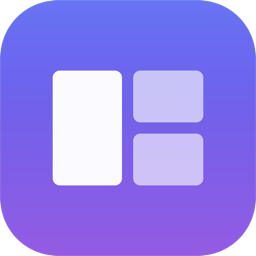

<div align="center">



# MacToys

**The Windows features macOS never shipped — for people who just switched.**

Clipboard history · Screenshot straight to clipboard · Aero-Snap window tiling · Windows keyboard behaviour

A single menu-bar app. No dependencies. No account. Nothing leaves your Mac.

</div>

---

## Why this exists

Switching from Windows to macOS, the hardware is lovely and then a dozen reflexes
stop working. Not big things — small ones, many times a day:

| You press | On Windows | On a Mac |
|---|---|---|
| `Win`+`V` | Your last 25 clipboard items | *Nothing. macOS has no clipboard history at all.* |
| `Win`+`Shift`+`S` | Screenshot lands on the clipboard, ready to paste | `⌘⇧4` drops a PNG on your Desktop instead |
| `Win`+`←` | Window snaps to the left half | Nothing. The green button throws you into a separate Space |
| `Home` / `End` | Jump to start / end of the line | Scrolls the whole document instead |
| `Ctrl`+`X` on a file | Cut, then paste to move it | Finder has no cut. The move is `⌘C` then `⌘⌥V` — undiscoverable |
| `Delete` on a file | Deletes it | Nothing. It's `⌘⌫` |

None of these are missing because they're hard. They're missing because Apple made
different choices, and there's no built-in way to choose otherwise. MacToys puts
them back, on the keys you already know.

## What it does

Everything is keyboard-first and runs from the menu bar.

| Feature | Shortcut | Notes |
|---|---|---|
| **Clipboard history** | `⇧⌘V` | Searchable, pinnable. Text, images and files. |
| **Snip to clipboard** | `⇧⌘S` | Drag a region → straight onto the clipboard. |
| **Snap left / right** | `⌃⌥←` `⌃⌥→` | Press again to cycle ½ → ⅓ → ⅔. |
| **Maximize / centre** | `⌃⌥↑` `⌃⌥↓` | A real maximize, not full-screen-in-its-own-Space. |
| **Snap to a corner** | `⌃⌥1`–`⌃⌥4` | |
| **Move to next display** | `⌃⌥⇧→` | Keeps the window's relative size and position. |
| **Windows `Home`/`End`** | `Home` `End` | Line start/end. `Ctrl` versions jump to document start/end. |
| **Cut & paste files** | `⌘X` then `⌘V` | In Finder. Uses Finder's own move, so undo still works. |
| **Delete a file** | `⌦` | In Finder. |
| **Keep awake** | menu | Like PowerToys Awake. |

The clipboard picker takes `↑``↓` to move, `⏎` to paste, `⌘1`–`⌘9` to grab an item
directly, `⌘P` to pin, `⌘⌫` to delete, `esc` to dismiss. Just type to filter.

## Install

Requires macOS 13 or later. Xcode is **not** needed — the Command Line Tools are enough.

```bash
git clone https://github.com/piyushrajput0/MacToys.git
cd MacToys
make install        # builds, bundles, and copies to /Applications
open /Applications/MacToys.app
```

Or build without installing:

```bash
make app && open dist/MacToys.app
```

`make test` runs the test suite. `make clean` removes build output.

MacToys lives in the menu bar — there's no Dock icon and no window until you ask
for one. The cheat sheet opens automatically the first time you run it.

## Permissions — and what works without them

Most of MacToys needs **nothing at all**:

| Works immediately | Needs Accessibility |
|---|---|
| Clipboard history | Window snapping |
| Snip to clipboard | Move window to next display |
| Keep awake | Windows `Home`/`End` |
| Menu bar, cheat sheet | Finder cut/paste and `⌦` |

Accessibility is required for the second column because macOS does not let one app
move another app's windows, or observe keystrokes, without explicit consent — which
is a good rule. It's a normal software permission (Rectangle, Raycast and Alfred all
ask for the same one) and it is granted per-app in
**System Settings › Privacy & Security › Accessibility**.

If you'd rather not grant it, the first column still works and MacToys will never
nag you — it just tells you once, at the moment you press a shortcut that needs it.

> **Rebuilding resets it.** The permission is tied to the app's code signature.
> This project signs ad-hoc, so the signature changes on every build and macOS will
> ask again. Remove the old entry and re-tick the box after `make install`.

## Privacy

A clipboard manager sees everything you copy, so this one is deliberately careful:

- **Nothing leaves your Mac.** There is no network code in this repository.
- **Passwords are skipped.** Pasteboards flagged `org.nspasteboard.ConcealedType` —
  the convention password managers use — are never recorded, and copies made in
  1Password, Bitwarden, Dashlane, Enpass, LastPass, Keychain Access and Apple
  Passwords are ignored by bundle identifier.
- **History is a plain file** at
  `~/Library/Application Support/MacToys/clipboard-history.json`.
  It is not encrypted. Delete it, or use *Clear Clipboard History* in the menu, whenever
  you like. Set `persistClipboardHistory` to `false` in `preferences.json` next to it
  to keep history in memory only.

## How some of it works

A few parts were more interesting than they look:

**Tiling that actually adds up.** Rounding each window rect independently
(`CGRect.integral`) expands every tile outward, so three thirds of a 1000px screen
each become 334px and overlap. `SnapGeometry` rounds the *shared boundaries*
instead, so tiles stay flush and the pieces sum back to the screen exactly. There's
a test for it.

**Two coordinate systems.** Cocoa measures screens from the bottom-left; the
Accessibility API measures from the top-left. Every rect has to be flipped between
them, and the transform is its own inverse — also tested, because getting it wrong
puts windows off-screen on multi-display setups.

**Finder cut/paste without touching your files.** MacToys never moves anything
itself. `⌘X` is rewritten to `⌘C` plus a flag, and the following `⌘V` becomes
`⌘⌥V` — Finder's own *Move Item Here*. Finder does the work, so conflict handling,
the progress sheet and undo all behave normally. Copying something else cancels the
pending move, as it does in Explorer.

**Hotkeys without permissions.** Carbon's `RegisterEventHotKey` is the only public
API that delivers a shortcut to a background app *and* swallows it, without
Accessibility. It's why the clipboard picker works the moment you launch.

**The event tap stays cheap.** macOS silently disables a keyboard tap that responds
too slowly, so the callback never makes cross-process calls — the frontmost app is
cached from a workspace notification instead. It also rewrites `keyUp` as well as
`keyDown`, or apps would wait forever for the release of a key they never saw pressed.

**Losing nothing on logout.** `applicationWillTerminate` is not called for a
`SIGTERM`, which is what macOS sends agents at shutdown. A dispatch signal source
catches it and flushes history first.

## Architecture

```
Sources/
  MacToysCore/        Pure logic. No AppKit, no permissions, no I/O.
    Keys.swift          Shortcut parsing, key codes, modifier sets
    SnapGeometry.swift  Tiling maths, cycling, coordinate flips, display moves
    ClipboardStore.swift Ring buffer, dedupe, pinning, ranked search, privacy rules
    RemapRules.swift    The whole key-remapping policy as one pure function
    Preferences.swift   Config, validation, atomic persistence
  MacToys/            The app. AppKit, Carbon, Accessibility, CGEventTap.
  MacToysSelfTest/    The test suite.
```

The split is the point: all the logic worth testing lives in `MacToysCore` and
depends on nothing, so it can be exercised headlessly. `RemapRules.outcome` decides
every keystroke rewrite and is a pure function of `(keystroke, frontmost app,
config)` — no event tap needed to test it.

## Testing

```bash
make test
```

61 tests, 125 assertions, no permissions and no GUI required. XCTest ships with
Xcode rather than the Command Line Tools, so the suite is a plain executable that
exits non-zero on failure — which also makes it trivial to run in CI.

Covered: shortcut parsing and rejection of malformed specs; exact tiling of halves,
thirds and quarters; gap arithmetic; snap cycling with tolerance for apps that
resize in steps; coordinate-flip involution; multi-display selection and clamping;
clipboard dedupe, pin-aware eviction, ranked search and round-trip persistence;
password-manager exclusion; every remap rule including app exclusions and the
`fn` modifier laptops add to `Home`/`End`; config clamping and fallback.

## Limitations

- **Full-screen windows can't be snapped.** macOS gives them their own Space and
  ignores placement. MacToys tells you instead of failing silently.
- **Some apps refuse to resize.** Apps with fixed or stepped window sizes (terminals,
  some editors) land a few pixels off. That's counted as success.
- **`Home`/`End` is skipped in terminals and editors** — they already do the right
  thing, and rewriting would break them. The list is `homeEndExcludedApps` in
  `preferences.json`.
- **Source attribution is a guess.** macOS doesn't record which app wrote to the
  pasteboard, so MacToys infers it from what was frontmost.
- **Ad-hoc signing** means the Accessibility grant resets on every rebuild.

## License

MIT — see [LICENSE](LICENSE).
